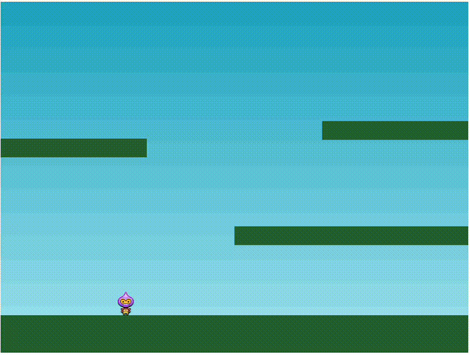

## Step 4: Controlando a nuestro heroe

_¡De 10! Ya tienes una pequeña base de un juego de plataformas :partying_face:_

Si el jugador no puede controlar nada, no es un videjuego. Por eso ahora veremos como podemos darle vida a nuestro personaje.

> :warning: <br> 🚨 Recuerda, solo trabajaremos con el archivo `script.js`. Por lo que deberemos tener cuidado.🚨

### :keyboard: Actividad: Permitir que el jugador controle al personaje

1.  Hace un pull del proyecto en tu computadora, mediante la terminal de VSCode.

    ```bash
    git pull
    ```

1.  Vamos a modificar el metodo `create` de la clase Game. En el mismo solo agregaremos una linea de codigo, que nos permitira obtener el estado del teclado.

    ```js
        create() {
            // TODO EL CODIGO ANTERIOR

            this.cursors = this.input.keyboard.createCursorKeys();
        }
    ```

1.  Ahora vamos a agregar el metodo `update` de la clase Game. Aqui debemos agregar las validaciones que nos permitan mover y ejecutar las animaciones del personaje.

    ```js
    update() {
        if (this.cursors.left.isDown) {
            this.player.setVelocityX(-160);
            this.player.anims.play("left", true);
            } else {
            if (this.cursors.right.isDown) {
                this.player.setVelocityX(160);
                this.player.anims.play("right", true);
            } else {
                this.player.setVelocityX(0);
                this.player.anims.play("turn");
            }
        }

        if (this.cursors.up.isDown && this.player.body.touching.down) {
        this.player.setVelocityY(-330);
        }
    }
    ```

    #### Vamos a explicarlo un poco:

    - **update**: es un metodo que se ejecuta en cada frame del juego. Es decir, 60 veces por segundo. Aqui es donde se debe poner la logica del juego. En este caso analizaremos el input por teclado del jugador y en base a eso movemos el personaje.
    - El primer if-else:
      > Se verifica si la tecla de flecha izquierda está presionada. Si es así, se le asigna una velocidad negativa al personaje, lo que lo hace moverse hacia la izquierda.
      > Se reproduce la animación "left" del personaje.
      > Se verifica si la tecla de flecha derecha está presionada. Si es así, se le asigna una velocidad positiva al personaje, lo que lo hace moverse hacia la derecha.
      > Se reproduce la animación "right" del personaje.
      > Si ninguna de las teclas de flecha está presionada, se le asigna una velocidad de 0 al personaje, lo que lo detiene.
      > Se reproduce la animación "turn" del personaje.
    - El segundo if:
      > Se verifica si la tecla de flecha arriba está presionada y si el personaje está tocando el suelo. Si es así, se le asigna una velocidad negativa al personaje en el eje Y, lo que lo hace saltar.

1.  Es hora de visualizar lo que hemos hecho. Para ello, deberas abrir el archivo `index.html` en tu navegador. Para ello, puedes hacerlo de dos formas:

    - Haciendo click derecho sobre el archivo y seleccionando la opcion `Abrir con Live Server`.
    - Haciendo click en el boton `Go Live` que se encuentra en la parte inferior derecha de VSCode.

    Luego de ello, deberas ir a tu navegador o browser favorito y abrir la url `http://localhost:5500/`. Deberas ver algo como esto:

    

1.  Por favor, realiza un commit con los cambios realizados y sube los cambios a tu repositorio remoto con los siguientes comandos, ejecutalos en la Terminal de VSCode.

    ```bash
    git add .
    git commit -m "commit controller"
    git push
    ```

1.  Espera unos 20 segundos y luego actualiza esta página (desde la que estás siguiendo las instrucciones). [GitHub Actions](https://docs.github.com/es/actions) se actualizará automáticamente al siguiente paso.
