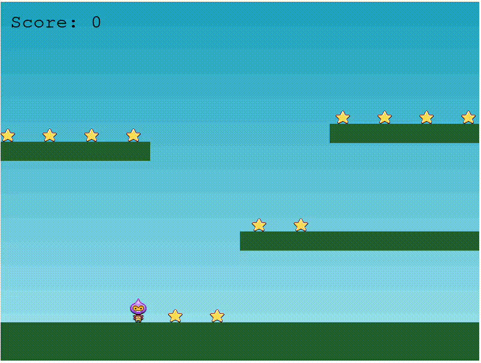

## Step 5: Agregando enemigos

_Al infinito y más allá con ese puntaje 💰_

Ya tenemos un sistema de puntaje, pero aún no tenemos enemigos. Ya es momento de agregarlos y tener un juego más completo.

> :warning: <br> 🚨 Recuerda, solo trabajaremos con el archivo `script.js`. Por lo que deberemos tener cuidado.🚨

### :keyboard: Actividad: Agregar enemigos

1.  Hace un pull del proyecto en tu computadora, mediante la terminal de VSCode.

    ```bash
    git pull
    ```

1.  Vamos a modificar el metodo `create` de la clase Game. En el mismo vamos a realizar varias actividades que explicaremos debajo.

    ```js
        create() {
          // TODO EL CODIGO ANTERIOR

          this.bombs = this.physics.add.group();
          this.physics.add.collider(this.bombs, this.platforms);
          this.physics.add.collider(
            this.player,
            this.bombs,
            this.hitBomb,
            null,
            this
          );
        }
    ```

    #### Vamos a explicarlo un poco:

    A. Se crea un grupo de bombas. No se agrega ninguna bomba. Eso lo haremos luego de juntar las primeras 12 estrellas.
    B. Se agrega la colisión entre las bombas y las plataformas. Esto hace que las bombas no puedan atravesar las plataformas.
    C. Se agrega la colisión entre el personaje y las bombas. Esto hace que el personaje pierda el juego si toca una bomba. Para lograrlo, se llama a una función llamada `hitBomb` cuando el personaje y una bomba colisionan.

1.  Vamos a modificar el metodo `collectStar` de la clase Game.

    ```js
      collectStar() {
        // TODO EL CODIGO ANTERIOR


        if (this.stars.countActive(true) === 0) {
          this.stars.children.iterate(function (child) {
            child.enableBody(true, child.x, 0, true, true);
          });

          var x =
            player.x < 400
              ? Phaser.Math.Between(400, 800)
              : Phaser.Math.Between(0, 400);

          var bomb = this.bombs.create(x, 16, "bomb");
          bomb.setBounce(1);
          bomb.setCollideWorldBounds(true);
          bomb.setVelocity(Phaser.Math.Between(-200, 200), 20);
        }
      }

    ```

    #### Vamos a explicarlo un poco:

    Se verifica si no quedan estrellas en el juego. Si es así, se vuelven a crear 12 estrellas, habilitando los cuerpos de las estrellas y dandole la posicion `y = 0` y se crea una bomba en una posición aleatoria del eje X.
    A la bomba se le asigna un rebote de 1, para que rebote siempre. Se le asigna un limite de colision con el mundo, para que no se salga del mundo. Se le asigna una velocidad aleatoria en el eje X y una velocidad de 20 en el eje Y.

1.  Vamos a agregar el metodo `hitBomb` de la clase Game.

    ```js
      hitBomb(player, bomb) {
        this.physics.pause();

        player.setTint(0xff0000);

        player.anims.play("turn");

        this.gameOver = true;
      }
    ```

    #### Vamos a explicarlo un poco:

    Se pausa la fisica del juego.
    Se le cambia el color al personaje a rojo.
    Se reproduce la animación "turn" del personaje.
    Se establece la variable `gameOver` en true.

1.  Es hora de visualizar lo que hemos hecho. Para ello, deberas abrir el archivo `index.html` en tu navegador. Para ello, puedes hacerlo de dos formas:

    - Haciendo click derecho sobre el archivo y seleccionando la opcion `Abrir con Live Server`.
    - Haciendo click en el boton `Go Live` que se encuentra en la parte inferior derecha de VSCode.

    Luego de ello, deberas ir a tu navegador o browser favorito y abrir la url `http://localhost:5500/`. Deberas ver algo como esto:

    

1.  Por favor, realiza un commit con los cambios realizados y sube los cambios a tu repositorio remoto con los siguientes comandos, ejecutalos en la Terminal de VSCode.

    ```bash
    git add .
    git commit -m "commit enemy"
    git push
    ```

1.  Espera unos 20 segundos y luego actualiza esta página (desde la que estás siguiendo las instrucciones). [GitHub Actions](https://docs.github.com/es/actions) se actualizará automáticamente al siguiente paso.
